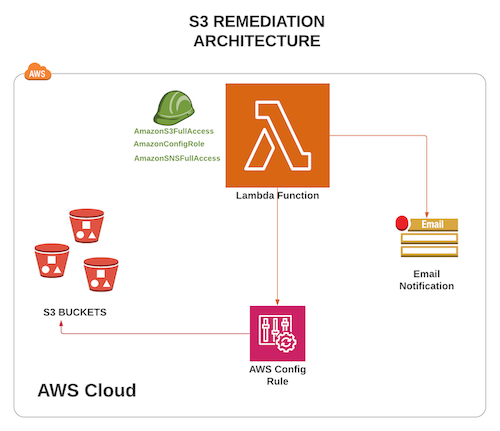
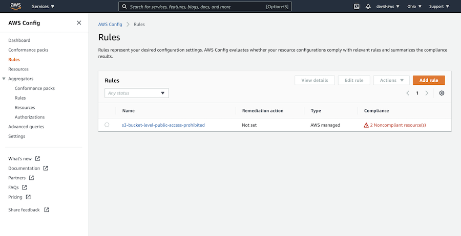
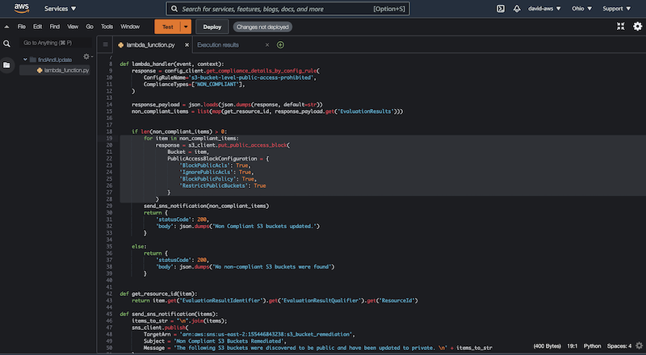
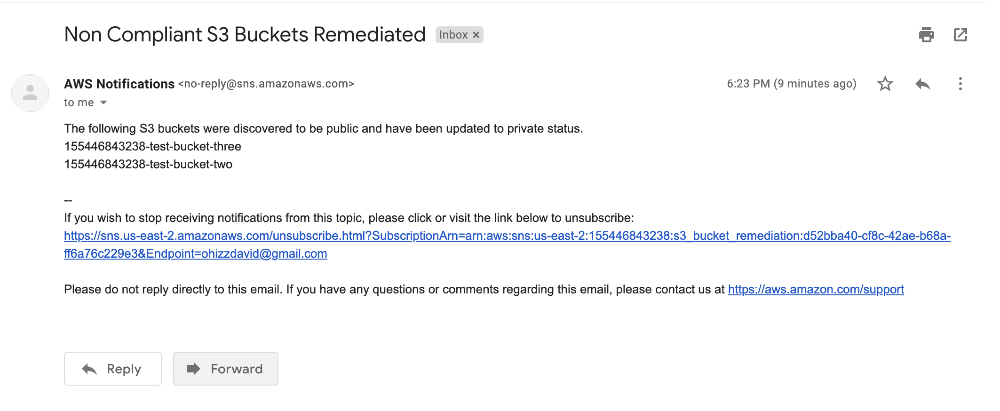

# s3_bucket_remediation

#### **Architecture Diagram**

#### Config Rule

* Create an AWS Config Rule that checks all S3 buckets and returns those that are public(non-compliant)
* 

#### Lambda Function

* Create a Lambda Function that uses the Config rule above to get the public S3 buckets and update their status to private.

#### SNS Notification

* The Lambda Function should also trigger an email notification using AWS Simple Notification Service(SNS) showing the non-compliant buckets and their updated status.

